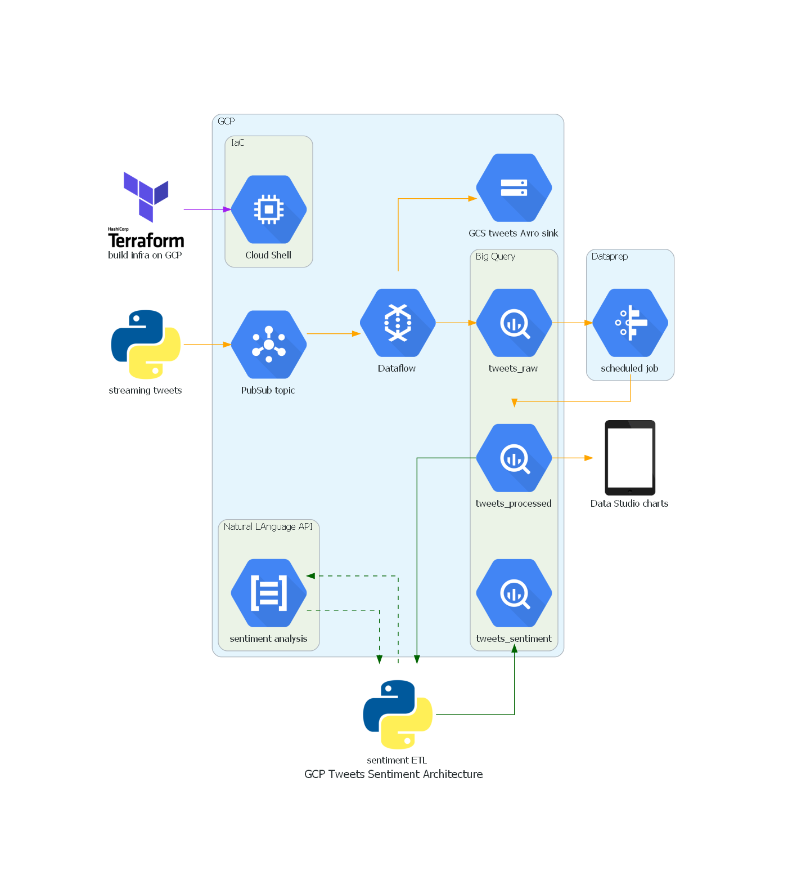

# GCP Big Data Project
<!-- vscode-markdown-toc -->
 1. [Project goal](#Projectgoal)
 2. [Business goal](#Businessgoal)
 3. [Project architecture](#Projectarchitecture)
 4. [Project technology stack](#Projecttechnologystack)
 5. [Terraforming](#Terraforming)
	* 5.1. [Repo Structure](#RepoStructure)
	* 5.2. [Logic](#Logic)
 6. [Twitter stream processing](#Twitterstreamprocessing)
	* 6.1. [Repo Structure](#RepoStructure-1)
	* 6.2. [Logic](#Logic-1)
 7. [GCP pipeline](#GCPpipeline)
	* 7.1. [Logic](#Logic-1)
 8. [Final notes](#Finalnotes)
	* 8.1. [Scheduling](#Scheduling)
	* 8.2. [Streamming](#Streamming)
	* 8.3. [Cloud Shell](#CloudShell)

<!-- vscode-markdown-toc-config
	numbering=true
	autoSave=true
	/vscode-markdown-toc-config -->
<!-- /vscode-markdown-toc -->

##  1. <a name='Projectgoal'></a>Project goal
<div style="text-align: justify">
This project goal was to create serverless, highly scalable and easy to implement and maintain streaming processor based on GCP platform. Apart from native GCP services external google/vendor services were uses (DataPrep and DataStudio). For Infrastructure as Code Terraform scripts were used. To orchestrate flow Python scripts were implemented and run from Cloud Shell environment. Given complexity of project some solutions were chosen due to business goals setup (see: Business Goals section. For project stack please refer to Project Stack section.
</div>


##  2. <a name='Businessgoal'></a>Business goal
<div style="text-align: justify">
To simulate real-life scenario business goal was defined.<br>
We are Data Engineer in marketing-analytical startup that can possibly be involved in US Presidential election 2024. To prove we can handle this task, we need to provide deep insight into social media buzz regarding possible two major candidates: D. Trump & J. Biden. Medium of choice we decided to be Twitter due to scale and involvement in previous election affairs. Different departments of startup contribute to this project:<br>
- Sales department want to have current information about media buzz and see which candidate is more popular to present their manipulations result to client <br>
- Marketing department wants some solution that will define sentiment of messages that flow in Twitter under both Presidents tags. They will use it to monitor startup PR efforts<br>
- Data department would like to have all data stored for future analysis including Tweeter users to see if there are any power-users who put positive/negative influence on the rest posting users and why.<br>
Startup decide to use GCP as platform of choice due to well known Data Processing abilities and their famous BigQuery. This was essential since Data Team knows SQL well. Company decide also that solution should maintain lowest cost possible during Proof of Concept phase. Startup also wants solution to be simple to deploy and scalable in the future. In the best case it should not engage DevOps team too much so should be least infrastructure to maintain.
</div>


##  3. <a name='Projectarchitecture'></a>Project architecture
<div style="text-align: justify">
Project architecture has modular form from which we can distinguish major parts (GCP, python scripts, DataPrep & DataStudio). Particular usage and solution variants of all components will be cover in further documentation.<br>
</div>




##  4. <a name='Projecttechnologystack'></a>Project technology stack
<div style="text-align: justify">

1. [GCP platform](https://cloud.google.com/) - Google Cloud Platform (GCP), offered by Google, is a suite of cloud computing services that runs on the same infrastructure that Google uses internally for its end-user products, such as Google Search, Gmail, Google Drive, and YouTube.Alongside a set of management tools, it provides a series of modular cloud services including computing, data storage, data analytics and machine learning. Registration requires a credit card or bank account details.
Google Cloud Platform provides infrastructure as a service, platform as a service, and serverless computing environments.
<br>

2. [Terraform](https://www.terraform.io) - Terraform is an open-source infrastructure as code software tool that provides a consistent CLI workflow to manage hundreds of cloud services. Terraform codifies cloud APIs into declarative configuration files.
<br>

3. [GCP - Cloud shell](https://cloud.google.com/shell/) - Cloud Shell is an online development and operations environment accessible anywhere with your browser. You can manage your resources with its online terminal preloaded with utilities such as the gcloud command-line tool, kubectl, and more. You can also develop, build, debug, and deploy your cloud-based apps using the online Cloud Shell Editor.
<br><span style = "background-color: #ABBAFF">Because Cloud Shell exist in GCP ecosystem it has some advantages regarding to credentials vs using SDK on on-prem machine.</span>
<br>

4. [Python](https://www.python.org/) - Python is an interpreted high-level general-purpose programming language. Its design philosophy emphasizes code readability with its use of significant indentation. Its language constructs as well as its object-oriented approach aim to help programmers write clear, logical code for small and large-scale projects
<br><span style = "background-color: #ABBAFF">In this project Python is used as connector, orchestrator ans scheduler. Essentially as front-end to tap into multiple APIs.</span>
<br>

5. [GCP - PubSub](https://cloud.google.com/pubsub/docs/overview) - Pub/Sub, which stands for Publisher/Subscriber, allows services to communicate asynchronously, with latencies on the order of 100 milliseconds.
Pub/Sub is used for streaming analytics and data integration pipelines to ingest and distribute data. It is equally effective as messaging-oriented middleware for service integration or as a queue to parallelize tasks.
<br><span style = "background-color: #ABBAFF">In this project Pub/Sub ingest tweeter stream.</span>
<br>

6. [GCP - DataFlow](https://cloud.google.com/dataflow/) - Dataflow is a fully managed service for executing Apache Beam pipelines within the Google Cloud Platform ecosystem. Dataflow jobs are billed per second, based on the actual use of Dataflow batch or streaming workers. Additional resources, such as Cloud Storage or Pub/Sub, are each billed per that service’s pricing.
<br><span style = "background-color: #ABBAFF">In this project Dataflow was chosen as a cost friendly solution that can handle flow to archiving tweets and populating BigQuery Table.</span>
<br>

7. [GCP - BigQuery](https://cloud.google.com/bigquery/) - BigQuery is a fully-managed, serverless data warehouse that enables scalable analysis over petabytes of data. It is a Platform as a Service that supports querying using ANSI SQL. It also has built-in machine learning capabilities.
<br><span style = "background-color: #ABBAFF">In this project Big Query handle data storage in tabular form and querying right data parts. Also it provides data for both semi-external services DataPrep & DataStudio.</span>
<br>

8. [GCP - Cloud Storage](https://cloud.google.com/storage/) - Google Cloud storage is a part of the Google Cloud Platform, which aims to be a competitor to Amazon S3 and Amazon Web Services (AWS) as well as other big names in the market such as Microsoft. It focuses on the development and deployment of modern web applications. Aimed at companies of all sizes, Google Cloud offers object storage with no limits on the amount of data stored or the size of objects. Google promises low latency and high durability for its service, and data can be stored in locations around the world. What’s more, it can be accessed via the command line or through a web browser.
<br><span style = "background-color: #ABBAFF">In this project Cloud Storage is used for archiving tweets in AVRO format.</span>
<br>

9. [GCP - Cloud Natural Language API](https://cloud.google.com/natural-language/) - The powerful pre-trained models of the Natural Language API empowers developers to easily apply natural language understanding (NLU) to their applications with features including sentiment analysis, entity analysis, entity sentiment analysis, content classification, and syntax analysis.
<br><span style = "background-color: #ABBAFF">In this project Natural LAnguage API is used to analyze and deliver tweet sentiment and magnitude of all streamed tweets.</span>
<br>

10. [DataPrep](https://cloud.google.com/dataprep/) - Dataprep by Trifacta is an intelligent data service for visually exploring, cleaning, and preparing structured and unstructured data for analysis, reporting, and machine learning. Because Dataprep is serverless and works at any scale, there is no infrastructure to deploy or manage. Your next ideal data transformation is suggested and predicted with each UI input, so you don’t have to write code.
<br><span style = "background-color: #ABBAFF">In this project DataPrep is used to initial clean tweets before sending to NL API and in mind of future usage of non-technical employees of startup who wants to produce tables not worrying about much technicalities.</span>
<br>

11. [DataStudio](https://datastudio.google.com) - Data Studio is Google's free data visualization tool that allows you to:
- Visualize your data through highly configurable charts and tables.
- Connect to a variety of data sources quickly and easily.
- Share your insights with your team or with the world.
- Collaborate on reports with your team.
 - Create reports even faster with built-in sample reports and community visualizations
<br><span style = "background-color: #ABBAFF">In this project DataStudio is used as an example of generating BigQuery originating report and chart.</span>
</dev>

# Project flow (incl. sample code and screenshots)

<br><span style = "background-color: #ABBAFF">Assumption: all scripts are run from within Cloud Shell where user is fully logged in and have all permissions already set up. Another way would be setting up a [service account](https://cloud.google.com/compute/docs/access/service-accounts) and generate access key which in some cases is prohibited (e.g. using own company landing zones).</span>


##  5. <a name='Terraforming'></a>Terraforming
<div style="text-align: justify">

###  5.1. <a name='RepoStructure'></a>Repo Structure
/tf<br>
|-- main.tf<br>
|-- variables.tf<br>
<br>

###  5.2. <a name='Logic'></a>Logic
1. Terraform script is invoked within Cloud Shell (in folder where .tf files are).
```sh
terraform init
```
```sh
terraform apply
```
to destroy stack
```shshell
terraform destroy
```
2. Terraform script:
- configure default project
```sh
#config default project
resource "null_resource" "health_check" {
    
    provisioner "local-exec" {
        command = "gcloud config set project ${var.project}"
    }
} 
```
- create GCS bucket with folders
- create PubSub topic with subscription
- Create BigQuery dataset with tables according to required schema
- Create and initiate DataFlow jobs to parse stream of tweets to GCS and PubSub
- configure dependencies between components so they are creates in right order
</div>


##  6. <a name='Twitterstreamprocessing'></a>Twitter stream processing
<div style="text-align: justify">

###  6.1. <a name='RepoStructure-1'></a>Repo Structure
/src<br>
|-- architecture_diag.py<br>
|-- IaC.sh<br>
|-- sentiment_processor.py<br>
|-- tweet_producer_full.py<br>
<br>
###  6.2. <a name='Logic-1'></a>Logic
1. To get Twitter stream we need to have Twitter developer account and generate Bearer token as authorisation method. Popular python library didn't work in this case (due to type of dev acct and limitations of API available) thus connecting to stream was done via requests
2. Decided was to filter out streams we need to analyze so additional requests were sent to appropriate endpoints to get current rules, delete all rules if any exists and setup a new set. we were interested in main tags of #trump and #biden.
   
```python
    sample_rules = [
        {"value": "#Trump lang:en -is:retweet", "tag": "#trump"},
        {"value": "#Biden lang:en -is:retweet", "tag": "#biden"}
    ]
```
3. Connection to API had to be composed such way, it will consist of all necessary information. Free API has it's limitation but in elevated version we can even have geo-location of the user. We choose GET method and  such selection of fields for this project:
```python
response = requests.get(
        "https://api.twitter.com/2/tweets/search/stream?tweet.fields=created_at,text,lang&user.fields=name,username,description&expansions=author_id", auth=bearer_oauth, stream=True,
    )
```
4. Tweet sample:
```json
{
    "tweet_id": "1484264852369510402",
    "tweet_created_at": "2022-01-20T20:41:31.000Z",
    "tweet_lang": "en",
    "tweet_text": "Yea and the networks are all over Pres #Biden like flys on shit They want us 2 believe he\'s worst than #Trump or any do NOTHING #Republican &amp; they come complete with FAKE #Polls Yes #MSNBC &amp; #CNN It\'s all they have FightPeople https://t.co/7PKEP7Mndg",
    "usr_descr": "36yrs Employed Now Retired United States Postmaster I now spend my time working with, advocating & speaking out 4 voiceless on political issues",
    "usr_id": "22066415",
    "usr_name": "Reda StCyr",
    "usr_username": "StCyrlyMe2",
    "tag": [
        "#trump",
        "#biden"
    ]
}
```
5. After analyzing tweet structure we encode it and parse to PubSub topic via .publish method
```python
 future = publisher.publish(topic_path, encoded_tweet)
 ```
we're using pubsub_v1 module from google.cloud.

6. Tweet stream now flows to our PubSub topic and populates subscription we've created.

<br><span style = "background-color: #ABBAFF">Twitter free API sometimes provide inconsistent stream (this is in ToC also) which results in streaming duplicates, that may cause downstream issues. Because duplicates comes one after another, we use simple trick to filter them out just before we parse them into PubSub.</span>
```python
        encoded_tweet = json.dumps(tweet).encode('utf-8')
        if get_vals(tweet_proc, 'id')[0] != prev_tweet_id:
            future = publisher.publish(topic_path, encoded_tweet)
            print(f'PUBLISHED MESSAGE ID: {future.result()}')
            print(tweet)
        else:
            print('duplicate!')
```
</div>


##  7. <a name='GCPpipeline'></a>GCP pipeline

###  7.1. <a name='Logic-1'></a>Logic
<div style="text-align: justify">

1. Tweets arrive in PubSub, to have a look if everything is processed correctly we can use subscription and pull some of those tweets.


2. DataFlow automatically fetch stream from topic and 
a) process tweets into Avro format and store 5 minutes tweet collections in GCS. This will be used as a raw archive for potential future processing. 


b) process tweets and send to BigQuery table <span style = "background-color: #ABBAFF"> (tweets_raw)</span>. Crucial at this point is to understand tweet schema and data types which will impact schema. Any deviation from this will result tweets not being parsed correctly. For this processing 5 minutes window is also used. 


Those are both streaming types of jobs which means we need to manually stop them if needed (e.g. for testing purposes). Here we have either Cancel option which will close processing immediately or Drain which will stop ingestion of tweets and process what's in queue.
In case we incorrectly define BQ schema, new table with error entries will be created. This is very useful during debugging process.

3. DataPrep is user friendly Data engine that can also be based on DataFlow (Apache Beam) depending which we choose for processing. We import BQ table we need and prepare transformations (called recipes) that are middle step between ingestion and saving to final table. Preparing recipe is very easy so non-technical employees would be able to manage that after short tutorial. For NLP sake we remove all unnecessary characters and save some of columns for further processing to new BQ table <span style = "background-color: #ABBAFF">(tweets_processed)</span>.


4. From <span style = "background-color: #ABBAFF">tweets_processed</span> data goes to Data Studio. This is another user friendly tool that could be used by non-technical employees. It let user to connect to main data sources (from and out of google ecosystem) and produce metrics and charts easily. It has also configurable sharing options so we can expose our work to outside world.Very interesting feature is ability to "blend" data which works like SQL JOIN but provides very friendly GUI (like whole suite). 


5. From <span style = "background-color: #ABBAFF">tweets_processed</span> data also is prepared for <span style = "background-color: #ABBAFF">sentiment_processor.py</span>.

a) First method use BigQuery connector to fetch correct dataset for processing. It can easily be done by composing SQL query
```sql
SELECT p.tweet_id, tweet_text FROM `piotr-ulanowski-sandbox-1.tweet_sentiment.tweets_processed` AS p
LEFT JOIN `piotr-ulanowski-sandbox-1.tweet_sentiment.tweets_sentiment` AS s
ON p.tweet_id = s.tweet_id
WHERE s.tweet_id IS NULL
```
Because we don't want to create unnecessary cost, we don't want to call NL API couple times for the same tweet. NL API charges for one block of processing (details in documentation).

b) we use NL API sentiment engine to get sentiment_score & sentiment_magnitude. 
```python
document = language_v1.Document(content=text, type_=language_v1.Document.Type.PLAIN_TEXT)
        sentiment = client.analyze_sentiment(request={"document": document}).document_sentiment
```

c) we extract correct fields that we will then pass as an argument to SQL query and call BigQuery api with the same method but aiming to populate final table <span style = "background-color: #ABBAFF">tweets_sentiment</span>. We do it for each tweet processed. 
```sql
INSERT INTO `piotr-ulanowski-sandbox-1.tweet_sentiment.tweets_sentiment`(tweet_id,sentiment_score, sentiment_magnitude) VALUES ('{}', {}, {}).format(tweet_id,sentiment_score,sentiment_magnitude)
```
<br><span style = "background-color: #ABBAFF">Despite ID is recognized as a string, query was still passing int thus we had to wrap {} in ''</span>
<br><span style = "background-color: #ABBAFF">Populating table could be done another way using pandas DataFrame and invoking special BQ method but for testing purposes one-by-one was sufficient.</span>

This script has also simple scheduler to loop execution in given time frame. For testing we've used seconds but in production it would be more aligned with DataFlow time frames (5 minutes or more).


</div>


##  8. <a name='Finalnotes'></a>Final notes

###  8.1. <a name='Scheduling'></a>Scheduling
<div style="text-align: justify">

Despite scheduling of particular tasks were done correctly we could consider use of Cloud Composer (based on Apache Airflow) to orchestrate <span style = "background-color: #ABBAFF">sentiment_processor.py</span> and trigger DataProc flows (although it has its own scheduler also). This solution was dropped because we aimed to lower cost and [Cloud Composer](https://cloud.google.com/composer)  runs on Kubernetes cluster (additional VMs to charge). For large scale operation this however be desirable solution.
</div>

###  8.2. <a name='Streamming'></a>Streamming
<div style="text-align: justify">

Tweet producer works well from Cloud Shell and we chose this way of running it due to not being able to properly generate Service Account key (company restrictions). Proper and scalable way of running this small app would be to put it into container and run on [Cloud Run](https://cloud.google.com/run) or [Google Kubernetes Engine](https://cloud.google.com/kubernetes-engine). This of course will bring additional costs but for production scale would be beneficial. 
</div>

###  8.3. <a name='CloudShell'></a>Cloud Shell
<div style="text-align: justify">

Cloud shell is very useful tool for managing GCP and running (or even developing) solutions. However it's not as persistent as dedicated VM and due to it's lifespan some libraries need to be re-installed on regular basis. Therefore if cost wouldn't be a problem we'd run scripts on dedicated VM. From positive aspects of Cloud Shell we have almost out-of-box integration with whole platform (permissions) and embedded google-cloud SDK & terraform and other useful tools. Editor tool is very nice addition and prototyping or debugging scripts can be done easily.
</div>